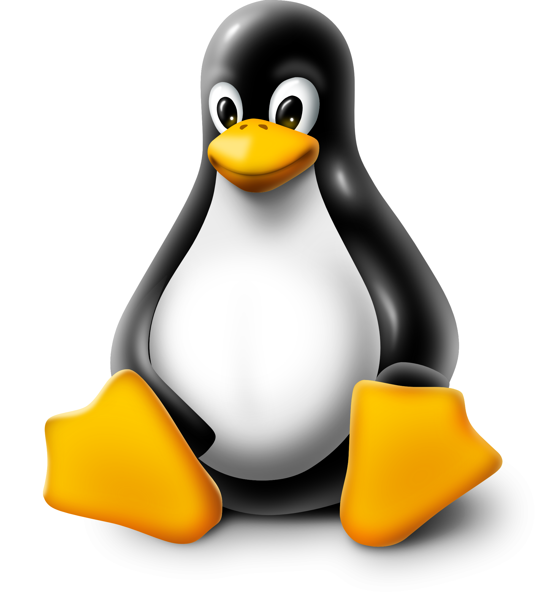

## Linux 

### What is Linux?
- Open source operating system.
- Free to use.
- Open source code to modify.
- Kernel base OS.
### History of Linux.
- Birthday 25th Aug 1991.
- Developed by Lunus Toevalds.
- Major Component
  - Kernel
  - Environment
  - File Structure
- Purpose for fun 😊
- Mascot for Linux TUX(Penguin).
### Distribution of Linux.
- Ubuntu
- Debian 
- Red Hat
- Gentoo
- Fedora
- Linux Mint
- Oracle
### Features of Linux
- Multiuser Capaiblity
- Multitasking
- Portability
- Security
- Live CD/USB 
- Graphical user interface
- Application Support
- File System
- Open Source
### Basic File system of Linux.
- `/bin` Basic program: All commands instruction/definition written in `/bin` directory eg: `ls, cd, dir, etc`.
- `/sbin` System program: that help OS to intract with other hardwarare are stored in `/sbin` directory eg: `fdisk, sysetl, mkfs, etc`.
- `/etc` Configuration files: when any software run in our system there all config; like port no, size, etc are stored in `/etc` directory.
- `/temp` Temporary files: Store data taht is reciently created and if user deleted and user want it again they get from `/temp` directory.
- `/usr/bin` Application: Other software that installed in system are stored in `/usr/bin` directory.
- `/usr/share` Application support and data files: if any software required extra files to run program that stored in `/usr/share` diractory.
- `/home` Personal directories or guest user.
- `/root` Admin directory.
### Linux basic command.
- `man`: manual comment
- `ls`: List all the folders and files of a directory.
- `ls -a`: Shows all hidden floders.
- `cd`: change directory.
- `cd ..`:change directory to previous.
- `pwd`: Check current working directory.
- `dir`: Same as `ls`.
- `mkdir`: Create new directory.
- `cp`: Copy a file or folder.
- `mv`: Move a file or folder. 
- `rm`: Remove a file or folder.
- `sudo su`: Grant root privileges - *great Power comes from great responsibility*.
- `cat`: Show content of a file.
- `nano`: Linux file editor.
- `chmod`: change directory permission.
- `./`: Execute shell file.
- `bash`: Execute shell program.
- `apt-get update`:Info about new version of system software.
- `apt-get upgrade`: Download and install new version of software.
- `apt-get install`: To install new software in system.
- `top`: Showing Linux process.
- `kill`: Terminate process.
- `w`: User login activity.
- `whoami`: Display active user name.
- `touch`: Create empty file.

### Multiple command in one line
- `;` 
- `&&`
- `||`
### Terminal Shortcuts
- `Tab`:Auto complete names.
- `CTRL+C` :Abort processing task.
- `CTRL+L` :Clear
- `CTRL+D` :EXIT
- `CTRL+ALT+D` :Minimize all terminal 
- `CTRL+U` :Clear line
- `CTRL+Z` :Suspend for background
- `CTRL+A` :Point to starting point
- `CTRL+Shift+C` :Copy
- `CTRL+Shift+V` :Paste